### Hi there 👋

I’m **Zhanwei Zhang**, an **M.Phil. student in Thrust of Data Science and Analytics** at **The Hong Kong University of Science and Technology (Guangzhou) — HKUST(GZ)**.

### About Me

- 🎓 **M.Phil. in Thrust of Data Science and Analytics** @ **HKUST(GZ)**
- 🎓 **B.Eng. in Computer Science and Technology** @ **SUSTech** (graduated)
- 🧭 Building towards impactful research and real-world LLM applications

### Contact Me

- 📧 Email: [zzhang364@connect.hkust-gz.edu.cn](mailto:zzhang364@connect.hkust-gz.edu.cn)
- 🌐 Website: https://it-bill.github.io/
- 📝 Blog: https://it-bill.github.io/blog/

### GitHub Stats

  
  

